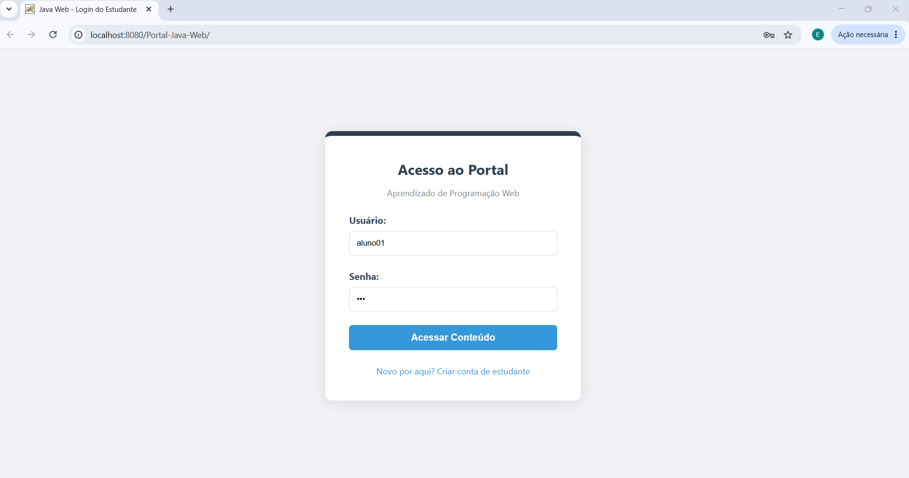
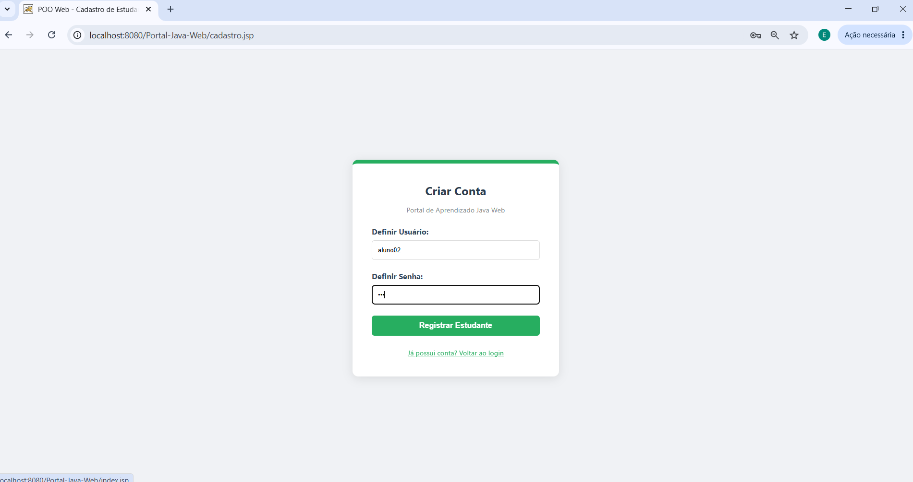
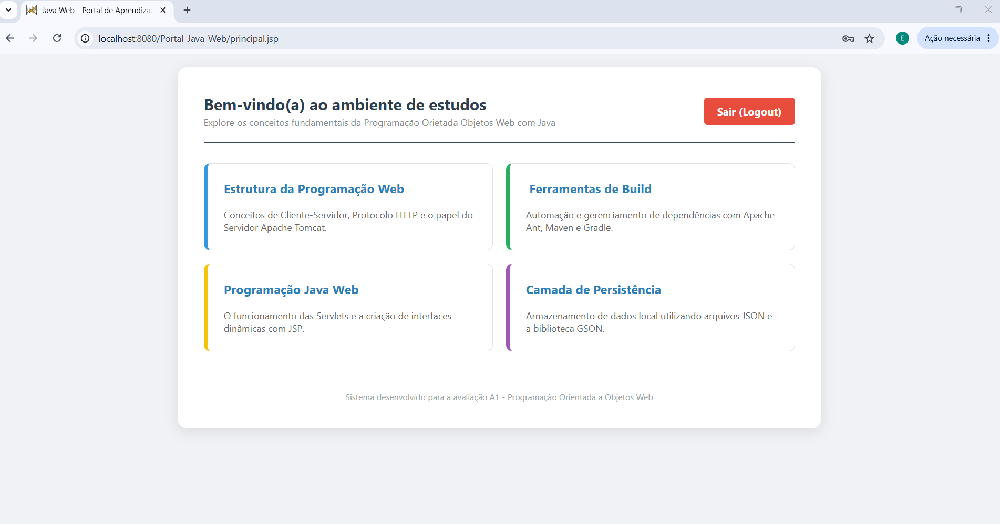
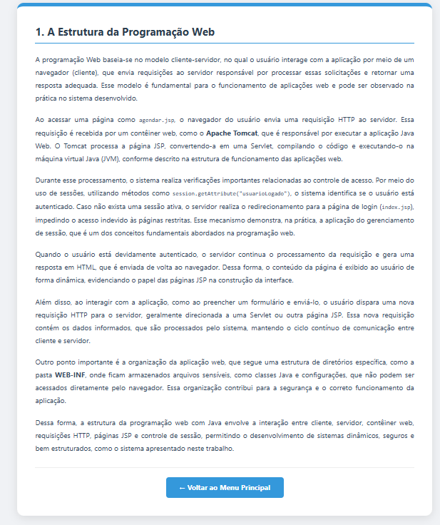
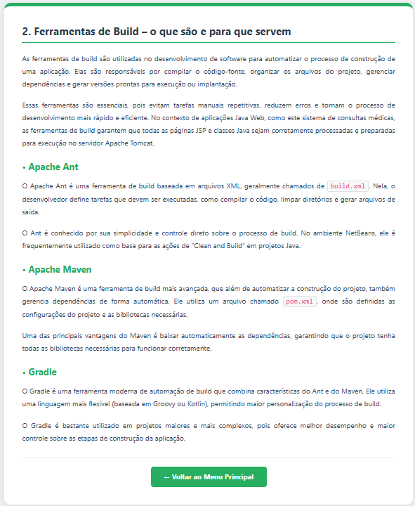
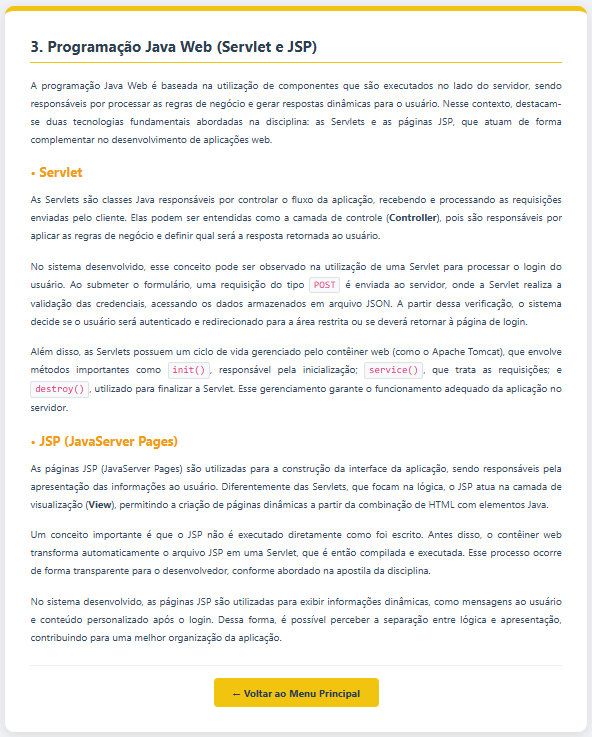
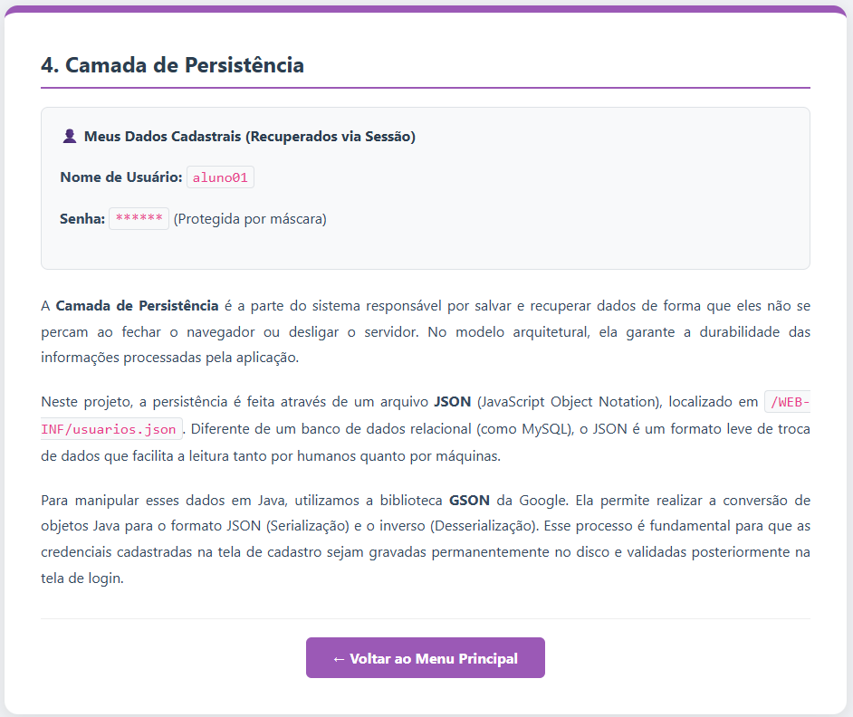

# 🎓 Portal Java Web — Controle de Sessão e Autenticação

Sistema Web desenvolvido em Java utilizando JSP, Servlets e controle de sessão (`HttpSession`) para autenticação de usuários.  
As credenciais são armazenadas em um arquivo JSON, permitindo persistência simples de dados sem utilização de banco de dados.

O projeto foi desenvolvido como atividade acadêmica da disciplina de Programação Orientada a Objetos Web.

---

# 📚 Objetivo do Trabalho

Desenvolver um site Java Web com autenticação de usuários por sessão, em que:

- As credenciais de acesso fossem armazenadas em arquivo JSON
- O sistema permitisse acesso restrito após login
- As páginas apresentassem conteúdos relacionados à Programação Web

---

# 🚀 Tecnologias Utilizadas

- ☕ Java
- 🌐 JSP (Java Server Pages)
- 🔧 Servlet
- 📦 Apache Tomcat
- 🗂️ JSON
- 🔵 Gson 2.13.2
- 💻 NetBeans IDE
- 🎨 HTML5 + CSS3

---

# 🔐 Funcionalidades

✅ Sistema de Login  
✅ Controle de Sessão com `HttpSession`  
✅ Cadastro de Estudantes  
✅ Área Restrita  
✅ Persistência de Dados em JSON  
✅ Navegação entre páginas JSP  
✅ Logout de usuário  

---

# 📸 Telas do Sistema

## 🔐 Tela de Login

Sistema responsável pela autenticação do usuário utilizando sessão HTTP.



---

## 👤 Cadastro de Conta

Página utilizada para registrar novos estudantes no arquivo JSON.



---

## 🏠 Menu Principal

Área restrita acessível apenas após autenticação.



---

# 📖 Conteúdos Desenvolvidos

## 1️⃣ Estrutura da Programação Web

Explicação sobre o funcionamento da arquitetura cliente-servidor, protocolo HTTP, Tomcat, JSP e sessões.



---

## 2️⃣ Ferramentas de Build — o que são e para que servem

Apresentação das ferramentas Apache Ant, Maven e Gradle.



---

## 3️⃣ Programação Java Web — Servlet e JSP

Conteúdo sobre o funcionamento das Servlets e páginas JSP na construção da aplicação.



---

## 4️⃣ Camada de Persistência

Demonstração da persistência de dados utilizando arquivos JSON e biblioteca Gson.



---

# 🗂️ Estrutura do Projeto

```bash
Portal-Java-Web/
│
├── Web Pages/
│   ├── WEB-INF/
│   │   ├── usuarios.json
│   │   └── web.xml
│   │
│   ├── cadastro.jsp
│   ├── estrutura.jsp
│   ├── build.jsp
│   ├── javaweb.jsp
│   ├── persistencia.jsp
│   ├── principal.jsp
│   └── index.jsp
│
├── Source Packages/
│   ├── controller/
│   └── model/
│
├── assets/
│   ├── login.png
│   ├── criarConta.png
│   ├── menu.png
│   ├── estrutura.png
│   ├── ferramentas.png
│   ├── servlet-jsp.png
│   └── persistencia.png
│
└── README.md
```

---

# ▶️ Como Executar o Projeto

## 1️⃣ Clonar o repositório

```bash
git clone https://github.com/seu-usuario/portal-java-web.git
```

---

## 2️⃣ Abrir no NetBeans

- File → Open Project
- Selecionar a pasta do projeto

---

## 3️⃣ Configurar o Apache Tomcat

Adicionar o servidor Apache Tomcat no NetBeans e vinculá-lo ao projeto.

---

## 4️⃣ Executar o sistema

Executar o projeto utilizando:

```bash
Run Project
```

---

# 🔑 Exemplo de Usuário JSON

```json
[
  {
    "usuario": "aluno01",
    "senha": "123456"
  }
]
```

---

# 🎯 Conceitos Aplicados

- Programação Java Web
- Arquitetura Cliente-Servidor
- JSP
- Servlet
- Sessão HTTP
- Persistência de Dados
- JSON
- Organização MVC
- Navegação entre páginas
- Controle de autenticação

---

# 👩‍💻 Desenvolvedora

Esther Nascimento

Projeto acadêmico desenvolvido utilizando Java Web, JSP, Servlets, JSON e Apache Tomcat.